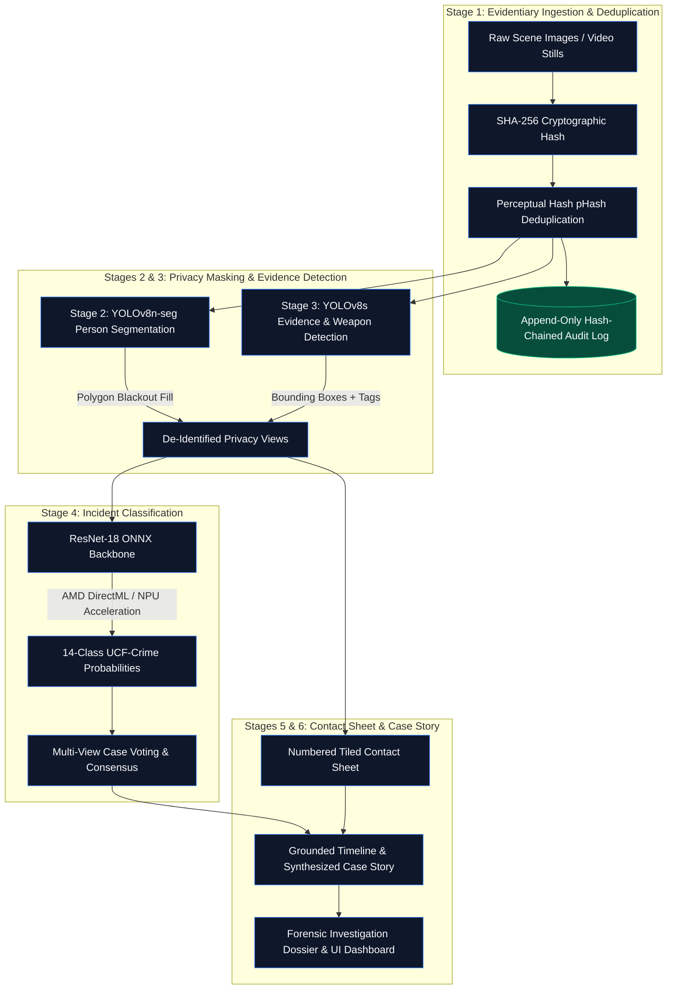

<div align="center">


<a href="#evaluation-results"></a>

<br/>

[](https://www.python.org/downloads/)
[](https://pytorch.org)
[](https://github.com/ultralytics/ultralytics)
[](https://onnxruntime.ai)
[](https://react.dev)
[](https://fastapi.tiangolo.com)
[](https://expressjs.com)
[](LICENSE)

<br/>

**[Research Framework](RESEARCH.md)** &nbsp;•&nbsp;
**[Training & Benchmarks](TRAINING.md)** &nbsp;•&nbsp;
**[Model Zoo & Hardware](MODELS.md)** &nbsp;•&nbsp;
**[Dataset Guidelines](datasets/README.md)** &nbsp;•&nbsp;
**[License](LICENSE)**

</div>

---

##  Project Overview

This project implements a complete, end-to-end **AI-Assisted Crime Scene Analysis & Forensic Reconstruction System**. It addresses the critical legal and evidentiary requirements of forensic computing: cryptographic evidence tamper-proofing, automated privacy de-identification, hardware-accelerated classification, and grounded multimodal reconstruction.

Raw surveillance footage and scene imagery are converted into a verified, timestamped case dossier containing:
1. **Cryptographic Chain of Custody:** Deterministic SHA-256 hash chaining preserving tamper-evident integrity from acquisition to presentation.
2. **Forensic Privacy De-Identification:** YOLOv8n-seg automated person masking to protect bystanders, victims, and witnesses before evidence reasoning.
3. **Evidence & Weapon Detection:** YOLOv8s localization of physical evidence (knives, firearms, vehicles, and tools) with high-contrast bounding boxes.
4. **Hardware-Accelerated Incident Classification:** ResNet-18 fine-tuned on the 14-class UCF-Crime benchmark, exported to ONNX and accelerated on AMD DirectML hardware (`DmlExecutionProvider`).
5. **Synthesized Case Reconstruction Story:** A unified narrative summarizing what crime occurred, weapon involvement, access points, and timeline progression without factual hallucinations.

### Key Capabilities

-  **Cryptographic Integrity:** Append-only SHA-256 hash chaining with an interactive tamper simulator to demonstrate tamper detection.
-  **Privacy-First Pipeline:** Automated polygon segmentation and blackout fill of all detected human bodies.
-  **Weapon & Evidence Catalog:** Detects sharp weapons, firearms, vehicles, and disturbance objects with category and confidence tags.
-  **AMD Hardware Acceleration:** Real-time edge inference on AMD Ryzen AI / DirectML (`DmlExecutionProvider`).
-  **Full-Stack MERN Dashboard:** React 19 UI with Dark/Light theme toggle, Express Node.js API, and FastAPI AI engine.

---

##  6-Stage Pipeline Architecture



| Stage | Operation | Model / Tool | Forensic Purpose |
|---|---|---|---|
| **1. Evidence Ingestion** | Cryptographic Hashing & Dedup | SHA-256 + pHash ($d \le 4$) | Establishes chain of custody; discards redundant near-identical frames |
| **2. Privacy Masking** | Person Segmentation & Blackout | YOLOv8n-seg (`class 0: person`) | Eliminates facial/identity recognition leakage before evidence reasoning |
| **3. Evidence Detection** | Evidence Object Bounding Boxes | YOLOv8s / Fine-tuned Weapon Model | Identifies and bounds weapons, tools, vehicles, and physical evidence |
| **4. Incident Classification** | 14-Class Scene Classification | ResNet-18 ONNX (DirectML) | Evaluates scene against 14 UCF-Crime classes; computes multi-view consensus |
| **5. Scene Reconstruction** | Synthesized Case Story & Timeline | Multi-View Grounding Engine | Assembles contact sheet, chronological timeline, and single cohesive incident story |
| **6. Audit Verification** | Cryptographic Tamper Verification | SHA-256 Merkle Chain | Validates that no historical frame, timestamp, or result has been modified |

---

##  Full-Stack Application Architecture

The system is deployed as an enterprise full-stack forensic application:

```text
┌─────────────────────────────────────────────────────────────┐
│                    React 19 Dashboard (Vite)                │
│                 http://localhost:5173                       │
│  - Theme Toggle (Dark / Light)     - Evidentiary Bounding Boxes│
│  - Instant 1-Click Demo Scenarios  - Probability Meters     │
│  - Tiled Contact Sheet Inspector   - Live Tamper Simulator  │
└──────────────────────────────┬──────────────────────────────┘
                               │ HTTP / JSON / Multipart
┌──────────────────────────────▼──────────────────────────────┐
│                    Express MERN Backend                     │
│                 http://localhost:5000                       │
│  - Case Dossier Management         - Audit Log Verification │
│  - Multer Ingestion Handling       - Service Orchestration  │
└──────────────────────────────┬──────────────────────────────┘
                               │ Proxy
┌──────────────────────────────▼──────────────────────────────┐
│                  FastAPI AI Inference Service               │
│                 http://127.0.0.1:8008                       │
│  - YOLOv8n-seg Masking             - ONNX DirectML Runtime  │
│  - YOLOv8s Evidence Detection      - Multi-View Synthesizer │
└─────────────────────────────────────────────────────────────┘
```

---

##  Quick Start

### 1. One-Click Launch (Windows)
Double-click [`start_app.bat`](start_app.bat) in the root directory. It automatically spins up all three services:
- **React Dashboard:** `http://localhost:5173`
- **Express MERN Server:** `http://localhost:5000`
- **FastAPI AI Engine:** `http://127.0.0.1:8008`

### 2. Manual Startup

```bash
# Terminal 1: FastAPI AI Engine (AMD Hardware Acceleration)
cd backend
python -m uvicorn main:app --host 127.0.0.1 --port 8008

# Terminal 2: Express MERN API
cd server
npm install
node server.js

# Terminal 3: React Dashboard
cd frontend
npm install
npm run dev
```

---

##  Quantitative Evaluation Summary

### UCF-Crime Test Benchmark (6,797 Frames)
Trained in [`notebooks/01_scene_analysis_pipeline.ipynb`](notebooks/01_scene_analysis_pipeline.ipynb) on a Google Colab T4 GPU across 11.0 GB of real CCTV imagery:

- **Top-1 Accuracy:** **14.2%** across 14 unbalanced crime classes (2.0× random chance baseline of 7.14%).
- **Macro F1-Score:** **0.123** | **Weighted F1-Score:** **0.126**
- **Top Class Performances:**
  - `NormalVideos`: **F1 = 0.446** (Precision: 0.354, Recall: 0.605)
  - `RoadAccidents`: **F1 = 0.198** (Precision: 0.160, Recall: 0.261)
  - `Arrest`: **F1 = 0.178** (Precision: 0.125, Recall: 0.312)

*Detailed per-class metrics, confusion matrices, and loss progression are documented in **[`TRAINING.md`](TRAINING.md)**.*

---

##  Repository Structure

```
mukesh-fs-ai-project/
├── backend/
│   ├── main.py              # FastAPI inference engine with demo endpoints
│   ├── pipeline.py          # 6-stage forensic pipeline implementation
│   └── export_npu.py        # PyTorch to ONNX DirectML/NPU converter
├── server/
│   ├── server.js            # Express MERN backend
│   └── package.json
├── frontend/
│   ├── src/
│   │   ├── App.jsx          # React 19 dashboard (theme toggle, SVG icons)
│   │   └── index.css        # Dark/Light CSS design variables
│   └── package.json
├── models/
│   ├── README.md            # Checkpoint specifications & instructions
│   ├── resnet18_ucf_crime.pth   # Trained PyTorch checkpoint (44.8 MB)
│   └── resnet18_ucf_crime.onnx  # Exported ONNX DirectML model (44.7 MB)
├── notebooks/
│   ├── 01_scene_analysis_pipeline.ipynb  # Executed Colab benchmark notebook
│   └── 02_weapon_detection.ipynb        # YOLOv8s weapon detection fine-tuning
├── test_images/             # Pre-configured test frames for instant demo
├── RESEARCH.md              # IEEE perspective & 2025-26 literature
├── TRAINING.md              # Full training methodology & confusion matrix
├── MODELS.md                # Model specifications & hardware acceleration
├── LICENSE                  # MIT License
├── start_app.bat            # One-click Windows launcher
└── README.md
```

---

##  Documentation Index

| Documentation File | Contents & Scope |
|---|---|
| **[`RESEARCH.md`](RESEARCH.md)** | Full IEEE research positioning, resolution of research gaps, 10 verified 2025–26 papers (VERA, MoniTor, TAO, ASK-Hint, Ex-VAD), and dataset profiles. |
| **[`TRAINING.md`](TRAINING.md)** | Complete Colab T4 training logs, loss curves, full 14-class test evaluation table, confusion matrix analysis, and weapon detection setup. |
| **[`MODELS.md`](MODELS.md)** | Architectural specifications for YOLOv8n-seg, YOLOv8s, ResNet-18 ONNX, and Qwen2.5-VL-3B, with AMD DirectML hardware acceleration benchmarks. |
| **[`LICENSE`](LICENSE)** | Full text of the standard MIT Open Source License. |

---

##  License

This project is licensed under the **MIT License** — see the [LICENSE](LICENSE) file for details.
